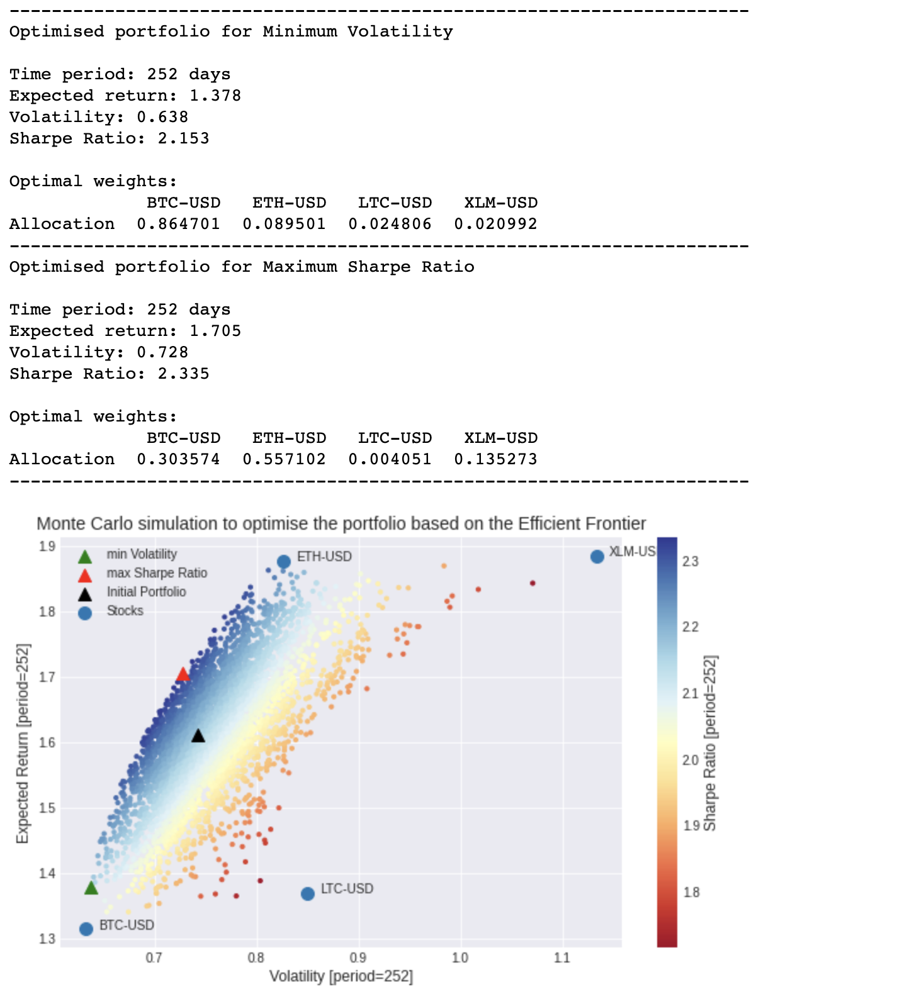

# portfolio-optimization
Cryptocurrency portfolio optimization

This repository contains a Jupyter notebook with a cryptocurrency portfolio investment strategy. Inspired by [Benjamin Cowen](https://intothecryptoverse.com/)'s videos related to maximizing your risk-adjusted returns by solving for the maximum Sharpe Ratio which exists on the Efficient Frontier. Crunching some historic returns and volatility data to find the portfolio which gives the best expected return for each unit of risk.

---



## Jupyter setup
I'm not really well up-to-date with the whole Python tooling, and thus prefer to run everything inside Docker containers.    
[Jupyter Docker Stacks](https://github.com/jupyter/docker-stacks) are a bunch of ready-to-run Docker images that contain a ready-made environment to run Jupyter applications.

### Build Jupyter container

```
docker build --rm -t docker-jupyter-extensible .
```

### Run Jupyter container

```
docker-compose up
```


## Resources
[Extensible Docker image for Jupyter Notebooks](https://github.com/augusto-herrmann/docker-jupyter-extensible)